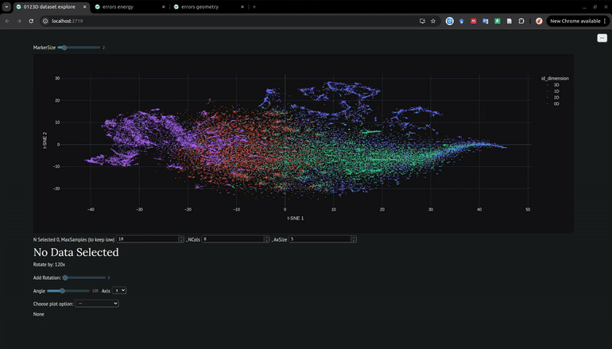

# 0123D benchmark

[](https://doi.org/10.1088/3050-287X/ae1208)

Explore in details the 0123D benchmark.

<div align="center">
    
</div>


## How to run

There are different pages, for each one you do:
```bash
uv run marimo run apps/explore_0123D_test_set.py
uv run marimo run apps/errors_energy.py
uv run marimo run apps/errors_geometry.py
```

To edit the notebooks:
```bash
uv run marimo edit apps/
```

Install uv: https://docs.astral.sh/uv/getting-started/installation/
Access to the ase db: `uv run ase db apps/public/0123D_pbe.db`
If this error `ase: error: OperationalError: no such column: "systems" - should this be a string literal in single-quotes?` is raised try to downgrade sql_version: `conda install -c conda-forge "sqlite=3.36.*"`


## How to cite

If you use this work, please cite:

[](https://doi.org/10.1088/3050-287X/ae1208)


